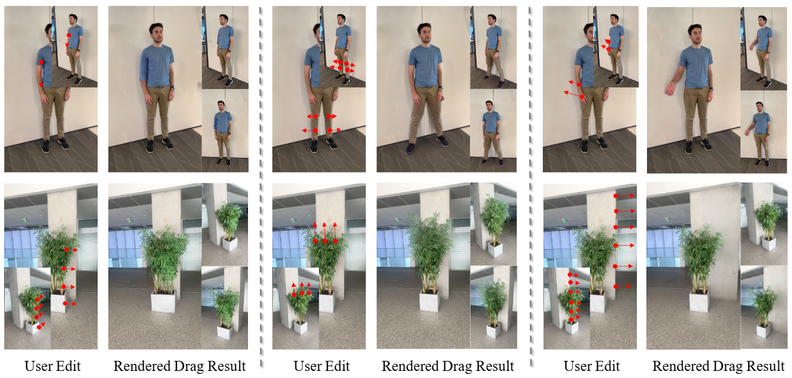

# 3DGS-Drag


[ICLR 2025] 3DGS-Drag: Dragging Gaussians for Intuitive Point-Based 3D Editing

# Install
```
conda create -n draggs python=3.10
conda activate draggs

pip3 install torch torchvision --index-url https://download.pytorch.org/whl/cu118
pip install -r requirements.txt

# set CUDA_HOME
export CUDA_HOME=<path of cuda>


# Required for colmap data processing
conda install -c conda-forge colmap
conda install -c conda-forge imagemagick

pip install submodules/diff-gaussian-rasterization
pip install submodules/simple-knn/
```

# Example Usage
## Data process (Follow Gaussian Splatting)
```
python convert.py -s <location> [--resize] #If not resizing, ImageMagick is not needed

python train.py -s <path to COLMAP or NeRF Synthetic dataset>
```

## Drag Editing (Currently needs the drag configuration file)
```
python train_drag.py -s <dataset path> --ply <checkpoint path> --drag_path <config path>
```
### Data examples: We provide one processed data from IN2N with config filese in `cfgs`. the example data can be downloaded from [drive](https://drive.google.com/file/d/1RJnzPVNobnH7RCOJNy5-sBVIjQJFPom8/view?usp=sharing)

## ✅ To-Do List
- [ ] GUI Interface

# Citation
```
@inproceedings{3dgs-drag2025,
      author = {Dong, Jiahua and Wang, Yu-Xiong},
      title = {3DGS-Drag: Dragging Gaussians for Intuitive Point-Based 3D Editing},
      booktitle = {ICLR},
      year = {2025},
     } 
```

# Acknowledgments
This work is greatly inspired aned based on 3D Gaussian Splatting (https://github.com/graphdeco-inria/gaussian-splatting)
